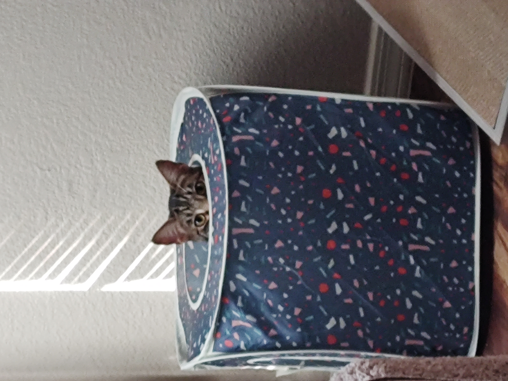

::: columns
::: {.column width="50%" style="text-align: center;"}

## Chris Annunziato

```{r, echo=FALSE, fig.align='center', out.width='40%'}

```


:::

::: {.column width="50%" style="text-align: left;"}

Hi, my name is Chris Annunziato and I am a Biostatistics MSPH student at Emory University. I have previously worked at the American Cancer Society on Breast Cancer Cox Propotional Hazard Models and with Dr. Robert Lyles at the Emory BIOS department on Rrobit Regression. You can connect with me on [linkedin](https://www.linkedin.com/in/chris-annunziato-53b159280/).

:::